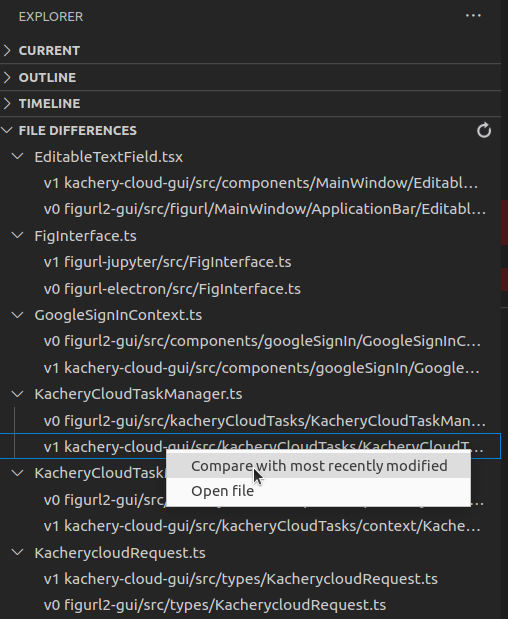

# sync-ts

This extension helps you keep .ts and .tsx files *in-sync* across multiple projects.

Suppose you have multiple typescript projects which share some common files and components. Extracting common functionality into a library is not always ideal. You may find yourself developing in each project separately, and then occassionaly syncing the improvements to the other projects.

This extension makes this process easier by automatically finding files with the same names across projects, comparing their contents, and presenting the user with the ability to visualize differences (via vscode.diff) and manually make synchronization decisions on a file-by-file bases.

For this to work, your various projects must be contained in some parent directory. Open vscode on that parent directory. The `FILE DIFFERENCES` view in the left panel will then be populated by file groups. Left-click the files in those groups to view files and diffs. Or use the context menus.

You can also add file groups to the ignore list. For example, syncing `index.ts` doesn't make much sense.

Hovering will show a REFRESH button.

## Usage

After installing the extension

* Make sure your typescript projects share some common parent directory.
* Open vscode on that parent directory.
* The `FILE DIFFERENCES` view in the left panel will be populated with file groups.
* Files within a group are sorted by modification date, with most recent at the top.
* Left-click a file to compare (diff) with the most recently modified in the group. Or if you click the most recent file, you'll just open that particular file.
* Right-click to use context menus for more options.
* Right-click a group name and select "Add to ignore list..." to ignore this file group. See `.sync-ts-ignore` in the workspace directory. The groups will be refreshed.
* Use the REFRESH button to recalculate the groups.